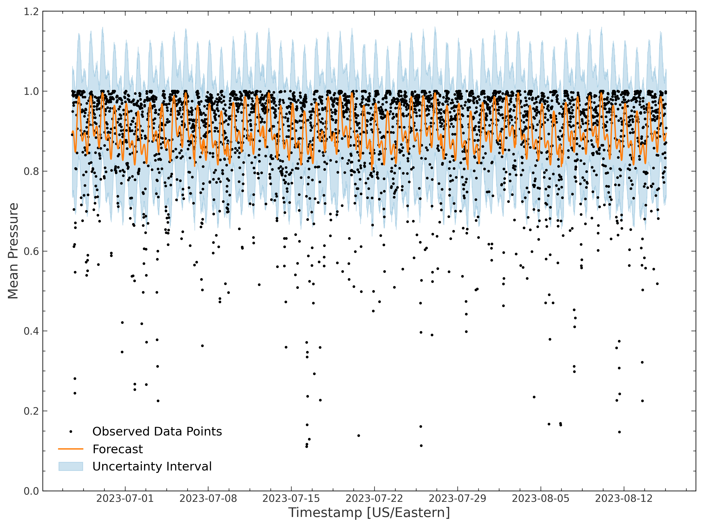

# chance\_of\_showers
Matthew Epland, PhD

This project provides live water pressure measurements
via a web dashboard running on a Raspberry Pi,
logs the data, and creates time series forecasts of future water pressure.

[![Prophet](https://img.shields.io/badge/Prophet-3b5998.svg?style=flat&logo=data:image/svg%2bxml;base64,PD94bWwgdmVyc2lvbj0iMS4wIiBlbmNvZGluZz0idXRmLTgiPz4KPCEtLSBHZW5lcmF0b3I6IEFkb2JlIElsbHVzdHJhdG9yIDIxLjAuMCwgU1ZHIEV4cG9ydCBQbHVnLUluIC4gU1ZHIFZlcnNpb246IDYuMDAgQnVpbGQgMCkgIC0tPgo8c3ZnIHZlcnNpb249IjEuMSIgaWQ9IkxheWVyXzEiIHhtbG5zPSJodHRwOi8vd3d3LnczLm9yZy8yMDAwL3N2ZyIgeG1sbnM6eGxpbms9Imh0dHA6Ly93d3cudzMub3JnLzE5OTkveGxpbmsiIHg9IjBweCIgeT0iMHB4IgoJIHZpZXdCb3g9IjAgMCA3Mi42IDcyIiBzdHlsZT0iZW5hYmxlLWJhY2tncm91bmQ6bmV3IDAgMCA3Mi42IDcyOyIgeG1sOnNwYWNlPSJwcmVzZXJ2ZSI+CjxzdHlsZSB0eXBlPSJ0ZXh0L2NzcyI+Cgkuc3Qwe2ZpbGw6I0ZGRkZGRjt9Cjwvc3R5bGU+CjxwYXRoIGNsYXNzPSJzdDAiIGQ9Ik0xMC4yLDQ5LjF2LTAuMWMwLTcuNiw1LjQtMTMuOCwxMy4zLTEzLjhjMS4yLDAsMi4zLDAuMiwzLjQsMC40bDYuMi03LjZjLTIuOC0xLjItNi0xLjgtOS41LTEuOAoJQzkuOSwyNi4xLDAsMzYuNSwwLDQ5LjF2MC4xYzAsNS4yLDEuNywxMC4xLDQuNywxMy45bDYuNy04LjNDMTAuNiw1My4xLDEwLjIsNTEuMSwxMC4yLDQ5LjF6Ii8+CjxwYXRoIGNsYXNzPSJzdDAiIGQ9Ik0zNi42LDQ2LjFjMC4yLDEsMC4zLDIsMC4zLDN2MC4xYzAsNy42LTUuNCwxMy44LTEzLjMsMTMuOGMtMi4zLDAtNC4zLTAuNS02LjEtMS41bC03LjgsNi4zCgljMy44LDIuNiw4LjUsNC4yLDEzLjgsNC4yYzEzLjcsMCwyMy42LTEwLjMsMjMuNi0yMi45di0wLjFjMC0zLjUtMC44LTYuNy0yLjEtOS42TDM2LjYsNDYuMXoiLz4KPGNpcmNsZSBjbGFzcz0ic3QwIiBjeD0iNTIuNCIgY3k9IjIwLjIiIHI9IjYuOSIvPgo8Y2lyY2xlIGNsYXNzPSJzdDAiIGN4PSI2OC43IiBjeT0iMy45IiByPSIzLjkiLz4KPC9zdmc+Cg==&logoColor=white)](https://github.com/facebook/prophet)
[](https://github.com/unit8co/darts)
[](https://pytorch.org)

[](https://plotly.com)
[](https://matplotlib.org)
[](https://github.com/pola-rs/polars)
[](https://github.com/pandas-dev/pandas)
[](https://flask.palletsprojects.com)
[](https://getbootstrap.com)
[](https://socket.io)
[](https://www.raspberrypi.com)
[](https://www.kicad.org)

[](https://python-poetry.org)
[](https://github.com/psf/black)
[](https://github.com/pylint-dev/pylint)
[](https://github.com/PyCQA/flake8)
[](https://github.com/python/mypy)
[](https://github.com/PyCQA/isort)
[](https://github.com/PyCQA/bandit)
[](https://github.com/DavidAnson/markdownlint)
[](https://github.com/svenkreiss/html5validator)
[](https://github.com/standard/standard)
[](https://github.com/adrienverge/yamllint)
[](https://prettier.io)
[](https://github.com/mrtazz/checkmake)
[](https://github.com/koalaman/shellcheck)
[](https://github.com/mvdan/sh)
[](https://github.com/pre-commit/pre-commit)

[](https://github.com/mepland/chance_of_showers/actions/workflows/tests.yml)
[](https://healthchecks.io)

[](LICENSE.md)

## Introduction
Living in a 5th floor walk up in NYC can save you on rent and gym memberships,
but runs the risk of leaving you high and dry when your water pressure gives out!
The pressure delivered from the city's water mains is
_[typically](https://cooperatornews.com/article/dispelling-myths-about-poor-water-pressure)_
sufficient to reach the 6th floor,
with higher buildings needing a booster pump and one of NYC's iconic rooftop
[water towers](https://www.amny.com/real-estate/water-towers-nyc-s-misunderstood-icons-1-6982696).
My building lacks a pump and water tower,
leaving my top floor apartment with _just barely_ satisfactory pressure,
as long as no other units are using water!
As you can see in the data below,
my daytime water pressure is all over the place.
After being stranded soapy and cold halfway through a shower one too many times,
I decided to use my data science and electronics skills to record
the time series of my apartment's hot water pressure
with the goal of forecasting future availability,
and hence `chance_of_showers` was born!

<div align="center">
  <video src="https://github.com/mepland/chance_of_showers/assets/4729931/f3b94d00-fa40-4b0b-8b95-1105d11e7acd"></video>
</div>

## Data Analysis Results
WIP

### Time Series Plots

Below is a sample of the pressure data collected in November 2023.
Clicking the links will open interactive plotly plots, please explore!

#### [Raw analog to digital converter (ADC) values](https://mepland.github.io/chance_of_showers/media/ana_outputs/mean_pressure_value_selected_data.html)

The data acquisition (DAQ) system saves the raw pressure data
from the analog to digital converter (ADC) as an integer between 0 and 65472.
Note that occasionally a water hammer will increase the pressure above its steady state value,
marked by the orange 100% reference line,
with a subsequent decay on the order of 10 minutes.
When water is flowing at the pressure sensor,
the data is shown with an open purple marker.
Using water reduces the pressure slightly under normal conditions,
and abruptly ends overpressure events.

#### [Normalized values](https://mepland.github.io/chance_of_showers/media/ana_outputs/mean_pressure_value_normalized_selected_data.html)

To clean the data before fitting any models,
I rescale the values to 0 and 1 between the steady state extrema.
Any values that are outside the normalization range are capped.

### Overall Pressure Distributions
|  |  |  |
| :---: | :---: | :---: |

### Prophet Results
|  |  |
| :---: | :---: |
|  |  |

## Hardware

### Bill of Materials
Here is a list of the components I used in my build.
With suitable alterations, the project could definitely be carried out with a wide array of other
sensors, single board computers or microcontrollers, plumbing supplies, etc.

#### Electronics

* [Raspberry Pi 4 Model B 2 GB](https://www.raspberrypi.com/products/raspberry-pi-4-model-b)
  * [USB C Power Supply](https://www.raspberrypi.com/products/type-c-power-supply)
  * [Micro SD Card](https://www.amazon.com/gp/product/B09TQS634Y)
* [8-Channel 10-Bit ADC with SPI Interface - MCP3008](https://www.digikey.com/en/products/detail/microchip-technology/MCP3008-I-P/319422)
* [DFRobot Gravity Water Pressure Sensor - SEN0257](https://wiki.dfrobot.com/Gravity__Water_Pressure_Sensor_SKU__SEN0257)
* [Water Flow Hall Effect Sensor Switch - YWBL-WH](https://www.amazon.com/Interface-Electromagnetic-Flowmeter-Industrial-Accessory/dp/B08B1NG4FZ)
* [1 kΩ and 10 kΩ Resistors](https://www.amazon.com/gp/product/B072BL2VX1)
* 830 Point Breadboard and Dupont Jumper Wires - [Included in GPIO Kit](https://www.amazon.com/gp/product/B08B4SHS18)

#### Plumbing

* [1/2" NPT 3 Way Tee Connector](https://www.amazon.com/Stainless-Diverter-Movable-Flexible-Connector/dp/B09MT39487)
* [Faucet Connector Hose, 3/8" Female Compression Thread to 1/2" Female NPT Thread - B1F09](https://www.amazon.com/gp/product/B000BQWNP8)
* [Adapter, 3/8" Male NPT to 1/2" Female NPT](https://www.amazon.com/gp/product/B07LD3GN4X/ref=ppx_od_dt_b_asin_title_s01)
* [Adapter, 1/2" Male NPT to G1/4" Female - ADT-N12M-G14F](https://koolance.com/threading-adapter-npt-1-2-male-to-g-1-4-female-adt-n12m-g14f)
* [PTFE (Teflon) Thread Seal Tape](https://www.amazon.com/DOPKUSS-Plumbers-Sealant-Waterproof-Inches/dp/B095YCMHNX)

#### Optional Components

* [I2C OLED Display](https://www.amazon.com/dp/B01MRR4LVE)
* [Geekworm Baseplate](https://www.amazon.com/gp/product/B07WCBXFD3)
* Wiring
  * [GPIO Extension Cable Kit](https://www.amazon.com/gp/product/B08B4SHS18)
  * [Breadboard Jumper Wires](https://www.amazon.com/gp/product/B07CJYSL2T)
  * [Clip to Dupont Jumper Wires](https://www.amazon.com/gp/product/B08M5GNY47)
* Cooling
  * [Heatsink - Geekworm P165-B](https://www.amazon.com/gp/product/B08N5VZN8R)
  * [Fan - Noctua NF-A4x20 5V PWM 4-Pin 40x20mm](https://www.amazon.com/gp/product/B071FNHVXN)
  * [2x20 Pin Header Kit](https://www.amazon.com/gp/product/B08GC18NMK) to clear heatsink
  * One [M3 Screw](https://www.amazon.com/gp/product/B01I74TTWU) to attach fan to heatsink
  * Four [M2.5 Screws](https://www.amazon.com/HELIFOUNER-Screws-Washers-Kit-Threaded/dp/B0BKSGC86F)
to attach heatsink to Pi and baseplate

### Circuit Diagram
The circuit diagram for this implementation
is provided as a [KiCad](https://www.kicad.org) schematic
[here](circuit_diagram/circuit_diagram.kicad_sch).


### Photos
|  |  |  |  |
| :---: | :---: | :---: | :---: |
|  |  |  |  |
|  |  |  |  |
|  |  |  |  |

## Data Acquisition (DAQ)

The DAQ system recorded 95.4% of possible data points overall,
and 99.870% since implementing the cron job heartbeat monitoring.

### Launching the DAQ Script
The provided [`start_daq`](daq/start_daq) bash script
will start the [`daq.py`](daq/daq.py) and [`fan_control.py`](fan_control/fan_control.py)
scripts in new `tmux` windows.
You will need to update the `pkg_path` variable in `start_daq` per your installation location.

```bash
source daq/start_daq
```

### Opening the Web Dashboard
If `daq: {display_web: true}` is set in [`config.yaml`](config.yaml),
the local IP address and port of the dashboard will be logged on DAQ startup.
Open this link in your browser to see the live dashboard, as shown in the introduction.

### Setting up cron Jobs
Jobs to restart the DAQ on boot and every 30 minutes,
as well as send heartbeat API calls - see below,
are provided in the [`cron_jobs.txt`](daq/cron_jobs.txt) file.
Note that loading this file with `crontab` will overwrite **any** current cron jobs,
so check your existing settings first with `crontab -l`!

```bash
crontab -l

crontab daq/cron_jobs.txt
```

You can verify the cron jobs are running as expected with:

```bash
grep CRON /var/log/syslog | grep $LOGNAME
```

### Heartbeat Monitoring
You can use the provided [`heartbeat`](daq/heartbeat) bash script to send heartbeat API calls
for the DAQ script to [healthchecks.io](https://healthchecks.io) for monitoring and alerting.
[Configure your alert online at healthchecks.io](https://healthchecks.io/docs/configuring_checks),
and then run the below commands to setup a `secrets.json` file with your alert's `uuid`.
You will need to update the `pkg_path` variable in `heartbeat` per your installation location.
The provided `cron_jobs.txt` will setup a cron job
to send the heartbeat on the 15 and 45 minute of each hour.

```bash
sudo apt install jq
echo -e "{\n\t\"chance_of_showers_heartbeat_uuid\": \"YOUR_UUID_HERE\"\n}" > secrets.json
source daq/heartbeat
```

## Dev Notes

### Data Analysis Setup - Installing CUDA and PyTorch

1. Find the supported CUDA version (`11.8.0`) for the current release of PyTorch (`2.0.1`) [here](https://pytorch.org/get-started/locally).
2. Install CUDA following the steps for the proper version and target platform [here](https://developer.nvidia.com/cuda-toolkit-archive).
3. Update the poetry `pytorch-gpu-src` source to point to the correct PyTorch version in [`pyproject.toml`](pyproject.toml).
    * This is in place of `pip install --index-url=...` as provided by the [PyTorch installation instructions](https://pytorch.org/get-started/locally).
4. Install the poetry `ana` group with `make setupANA`.
    * This will install `pytorch`, along with the other necessary packages.
5. Check that PyTorch and CUDA are correctly configured with the following `python` commands:

```python
import torch

if torch.cuda.is_available():
    print("CUDA is available")
    print(f"Device name: {torch.cuda.get_device_name(torch.cuda.current_device())}")
else:
    print("CUDA IS NOT AVAILABLE!")
```

### DAQ Setup - Installing Python 3.11 on Raspbian
If `python 3.11` is not available in your release of Raspbian,
you can compile it from source following the instructions [here](https://aruljohn.com/blog/python-raspberrypi),
but will also need to [install the sqlite extensions](https://stackoverflow.com/a/24449632):

```bash
cd /usr/src/
sudo wget https://www.python.org/ftp/python/3.11.4/Python-3.11.4.tgz
sudo tar -xzvf Python-3.11.4.tgz
cd Python-3.11.4/
sudo apt update && sudo apt full-upgrade -y
sudo apt install build-essential zlib1g-dev libncurses5-dev libgdbm-dev libnss3-dev libsqlite3-dev -y
./configure --enable-optimizations --enable-loadable-sqlite-extensions
sudo make altinstall

# Should be Python 3.11.4 with your compile info
/usr/local/bin/python3.11 -VV

# Link binary
sudo rm /usr/bin/python
sudo rm /usr/bin/python3
sudo ln -s /usr/local/bin/python3.11 /usr/bin/python
sudo ln -s /usr/local/bin/python3.11 /usr/bin/python3

# Should match /usr/local/bin/python3.11 -VV
python -VV
```

### Installing Dependencies with Poetry
Install `poetry` following the [instructions here](https://python-poetry.org/docs#installation).

```bash
curl -sSL https://install.python-poetry.org | python3 -
```

Then install the `python` packages needed for this installation. Groups include:

* `daq` for packages needed to run the DAQ script on a Raspberry Pi, optional
* `web` for packages needed to run the live dashboard from the DAQ script, optional
* `ana` for analysis tools, optional
* `dev` for continuous integration (CI) and linting tools

```bash
poetry install --with daq,web
```

or

```bash
poetry install --with ana
```

### Setting up pre-commit
It is recommended to use the [`pre-commit`](https://pre-commit.com) tool
to automatically check your commits locally as they are created.
You should just need to [install the git hook scripts](https://pre-commit.com/#3-install-the-git-hook-scripts),
see below, after installing the `dev` dependencies.
This will run the checks in [`.pre-commit-config.yaml`](.pre-commit-config.yaml)
when you create a new commit.

```bash
pre-commit install
```

### Installing Non-Python Based Linters
Markdown is linted using [`markdownlint-cli`](https://github.com/igorshubovych/markdownlint-cli),
JavaScript by [`standard`](https://github.com/standard/standard),
and HTML, SCSS, and CSS by [`prettier`](https://prettier.io).
You can install these JavaScript-based linters globally with:

```bash
sudo npm install -g markdownlint-cli standard prettier
```

Shell files are linted using [`shellcheck`](https://github.com/koalaman/shellcheck)
and [`shfmt`](https://github.com/mvdan/sh).
Follow the linked installation instructions for your system.
On Fedora they are:

```bash
sudo dnf install ShellCheck shfmt
```

### Using the Makefile
A [`Makefile`](Makefile) is provided for convenience,
with commands to setup the DAQ and analysis environments,
`make setupDAQ` and `make setupANA`,
as well run CI and linting tools,
e.g. `make black`, `make pylint`, `make pre-commit`.
